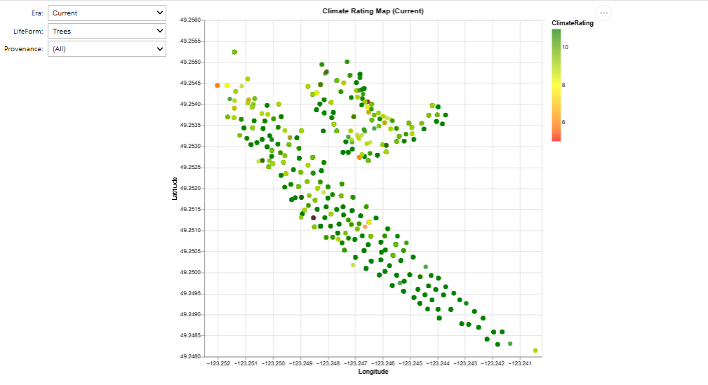

## Climate Suitability Widget

This tool allows you to explore UBCBG garden accessions and their future climate ratings under several modeled scenarios.

👉 **[Launch Interactive Widget](https://mybinder.org/v2/gh/Kkubeck/nursery-manual/HEAD?urlpath=voila/render/notebooks/climate-rating-widget.ipynb)**  
*(via Voilà on Binder)*

---

*Note: This will open in a new tab using Binder and Voilà. It may take ~30 seconds to launch the first time.*
