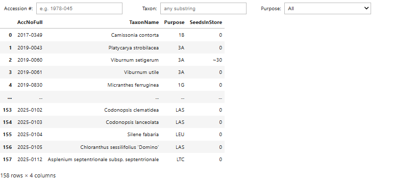

# Seed Store Inventory

# Seed Store Inventory

This interactive widget lets you explore the current inventory of seeds in the Seed Store by accession number, taxon name, or purpose.

[🚀 Launch Interactive Inventory via Voilà](https://mybinder.org/v2/gh/Kkubeck/nursery-manual/main?urlpath=voila/render/notebooks/seed-store-inventory_widget.ipynb)

---

*Note: This will open in a new tab using Binder and Voilà. It may take \~30 seconds to launch the first time.*

